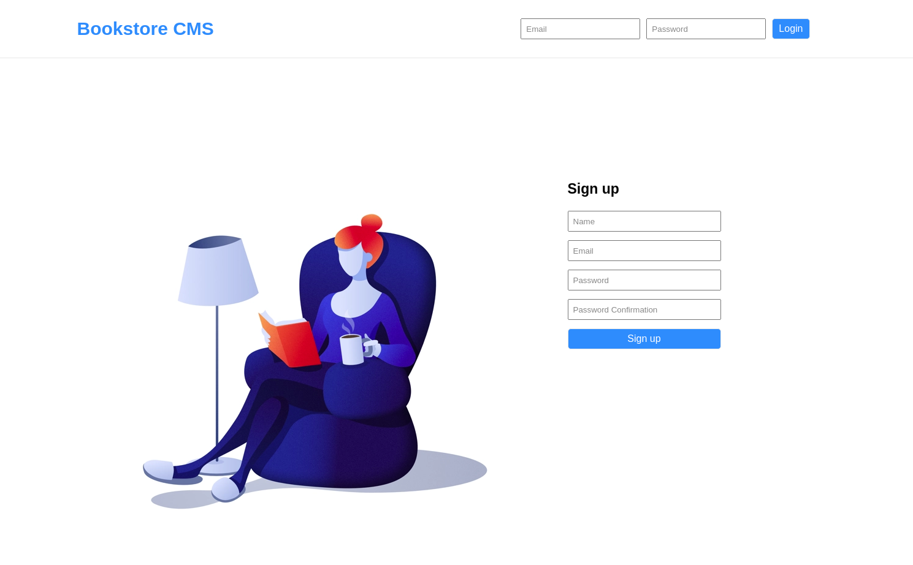
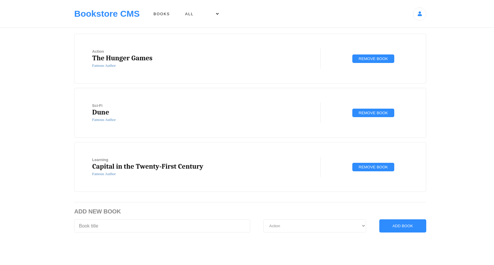
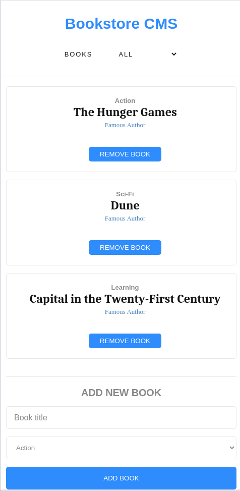

### React Bookstore

## Table of Contents

* [About the Project](#about-the-project)
  * [Built With](#built-with)
* [Setup](#setup)
* [Author](#author)
* [Show your Support](#show-your-support)
* [Acknowledgements](#acknowledgements)

<!-- ABOUT THE PROJECT -->
## About The Project

### Home

<p align="center">
  
</p>

### Dashboard

<p align="center">
  
</p>

### Mobile

<p align="center">
  
</p>

In this project, I created a Bookstore App using React and Redux for a fictional company named "Magic-books Inc".
And I connected it to a Rails API, from which the users and books are served from.

Live version of the project: [Live version](https://bookstore-cms-ermin.netlify.app/)

Rails API: 
  - [Live URL](https://bookstore-rails-api.herokuapp.com/)
  - [GitHub Repository](https://github.com/ermin-cahtarevic/bookstore-cms-api)

Project Link: [React-Bookstore](https://github.com/ermin-cahtarevic/react-bookstore)


### Built With

*   React
*   Redux
*   npm
*   CSS
*   ES6

## Setup

```
git clone git@github.com:ermin-cahtarevic/react-bookstore.git
```
### Install dependencies

```
npm install
```

### Start Development Server

```
npm start
```
### Visit this link in your browser
```
http://localhost:3000/
```

### Run ESlint

```
npx eslint .
```
### Run Stylelint

```
npx stylelint "**/*.{css,scss}"
```
<!-- CONTACT -->
## Author

- Github: [@ermin-cahtarevic](https://github.com/ermin-cahtarevic)
- Twitter: [@ErminCahtarevic](https://twitter.com/ErminCahtarevic)
- Linkedin: [Ermin Cahtarevic](https://www.linkedin.com/in/ermincahtarevic/)

<!-- ABOUT THE PROJECT-->
## Show your support

Give a star if you like this project!

<!-- ACKNOWLEDGEMENTS -->
## Acknowledgements

* [Microverse](https://www.microverse.org/)
